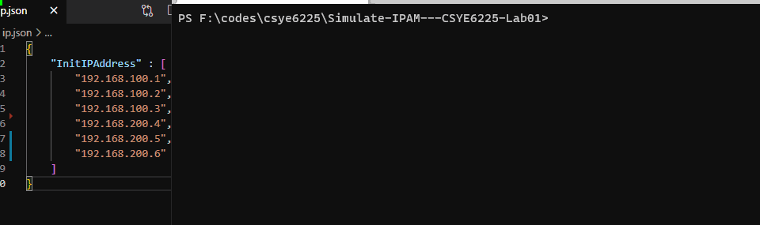

# CSYE6225-Lab01 Simulate IPAM

## Introduction

Used AWS SQS service to stimulate a client-server IPAM.

Used the FIFO SQS Queue to store available IP addresses.

This is a pure **CLI program**.

After start the program:

- Enter `a` to let program send some IP addresses stored in [config.json](config.json) to server.
- Enter `c` to get an available IP address from server.
- Enter `q` or `Ctrl + c` to quit the program.

<!-- Do not send same IP address twice within 5 minutes. The AWS SQS has a fixed deduplication interval, any msg recognized as same cannot be sent to SQS queue for multi times within 5 minutes. -->

## Run

1. Download dependencies

```shell
go mod download
```

2. Go directly

```shell
go run ./cli/main.go
```

3. Build and run

```
go build ./cli
./cli
# ./cli.exe # windows
```

## Demo




